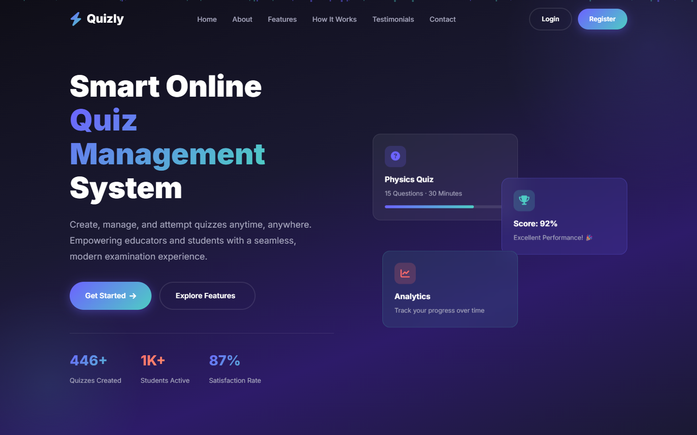
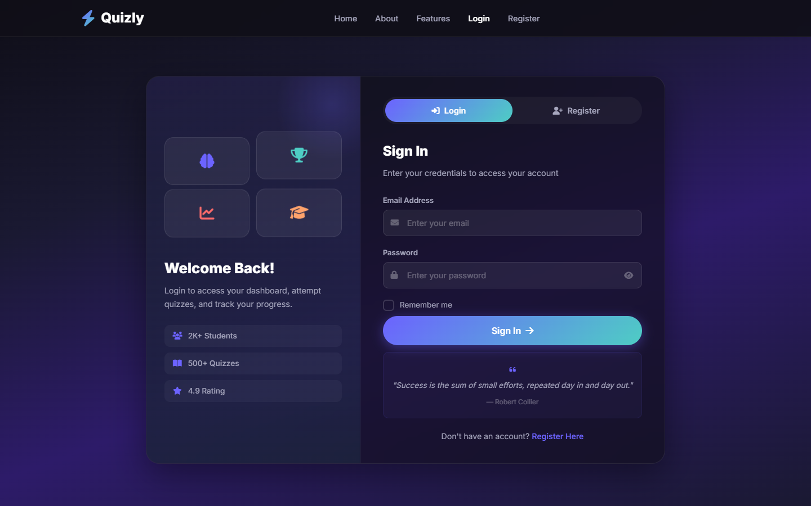

# 🚀 Quizly — Full-Stack Online Quiz Management System

**Quizly** is a premium, full-stack web application designed for educational institutions to manage online examinations seamlessly. Built with a focus on high-performance, security, and modern aesthetics (Glassmorphism), it provides a robust platform for Teachers, Students, and Admins.

---

## ✨ Features

### 👨‍🏫 Teacher Panel
- **Quiz Wizard**: Create comprehensive quizzes with MCQs, True/False, custom marking schemes, and negative marking.
- **Dynamic Question Builder**: Add, edit, and delete questions with mandatory correct answer validation.
- **Performance Analytics**: Visual charts showing average scores, top performers, and subject-wise analytics.
- **Result Monitoring**: Track student submissions in real-time.
- **Account Management**: Self-delete account with full cascade removal of all created data.

### 🎓 Student Panel
- **Interactive Dashboard**: View available quizzes, recent attempts, and overall performance charts.
- **Smart Quiz Engine**: Timed exams with anti-cheat detection (tab-switching alerts) and auto-submit.
- **Instant Grading**: Automated evaluation with detailed breakdowns (correct/wrong per question).
- **Leaderboard**: Compete with peers and track ranking.
- **Search & Filter**: Filter quizzes by subject, difficulty, and keyword search.
- **Account Management**: Self-delete account with removal of all attempt history.

### 🛡️ Admin Panel
- **User Management**: View, block/unblock, and delete Students & Teachers.
- **Quiz Moderation**: Monitor and remove any quiz across the platform.
- **System Analytics**: Monthly activity stats, top students, top teachers.
- **Role-Based Access Control**: Secure JWT authentication with route-level protection.

### 🔐 Security
- **JWT Authentication**: Token-based stateless auth with 24-hour expiry.
- **Bcrypt Hashing**: All passwords are salted and hashed (10 rounds).
- **Parameterized SQL Queries**: Protection against SQL injection attacks.
- **Anti-Cheat System**: Tab-switching detection during live exams.
- **Account Blocking**: Admin can block users without deleting their data.

---

## 🛠️ Technology Stack

| Layer | Technology |
|-------|-----------|
| **Frontend** | HTML5, CSS3 (Glassmorphism), JavaScript (ES6+), FontAwesome |
| **Backend** | Node.js, Express.js |
| **Database** | MySQL (Relational) |
| **Authentication** | JWT, Bcrypt.js |
| **Environment** | Dotenv |

---

## 📁 Project Structure

```
Quizly/
├── public/                   # Frontend files
│   ├── index.html            # Landing page
│   ├── auth.html             # Login & Register page
│   ├── student-dashboard.html
│   ├── teacher-dashboard.html
│   ├── admin.html
│   ├── attempt-quiz.html     # Quiz attempt engine
│   ├── quiz-result.html      # Result breakdown page
│   ├── styles.css            # Global design system
│   ├── auth.css              # Auth page styles
│   ├── dashboard.css         # Dashboard styles
│   ├── quiz.css              # Quiz attempt styles
│   ├── app.js                # Shared utilities (toast, nav)
│   ├── auth.js               # Login/Register logic
│   ├── dashboard.js          # Student dashboard logic
│   ├── teacher.js            # Teacher panel logic
│   └── quiz.js               # Quiz engine logic
├── server.js                 # Express API server
├── db.js                     # MySQL connection pool
├── database.sql              # Database schema
├── package.json
├── .env                      # Environment variables (not committed)
├── .gitignore
└── README.md
```

---

## 🚀 Getting Started

### 1. Prerequisites
- [Node.js](https://nodejs.org/) (v18+) installed.
- [MySQL](https://www.mysql.com/) installed and running.

### 2. Database Setup
```sql
-- Log in to MySQL and run:
CREATE DATABASE quizly_db;
USE quizly_db;
SOURCE database.sql;
```

### 3. Installation
```bash
# Clone the repository
git clone https://github.com/Shushank988/Quizly.git

# Navigate to the project directory
cd Quizly

# Install dependencies
npm install
```

### 4. Configuration
Create a `.env` file in the root directory:
```env
PORT=5000
DB_HOST=localhost
DB_USER=root
DB_PASSWORD=your_password
DB_NAME=quizly_db
JWT_SECRET=your_super_secret_key

# Admin Configuration
ADMIN_EMAIL=admin@quizly.com
ADMIN_PASSWORD=your_secure_admin_password
```

### 5. Run the Application
```bash
npm start
```
Open your browser at `http://localhost:5000`

### 6. Admin Access
The admin account is automatically configured using the credentials in your `.env` file when the server starts. You can change the password securely anytime through `.env`.

---

## 📡 API Endpoints

### Auth
| Method | Endpoint | Description |
|--------|----------|-------------|
| POST | `/api/auth/register` | Register a new user |
| POST | `/api/auth/login` | Login and get JWT token |
| DELETE | `/api/account/delete` | Self-delete account (cascades) |

### Student
| Method | Endpoint | Description |
|--------|----------|-------------|
| GET | `/api/student/quizzes` | Get all available quizzes |
| GET | `/api/quiz/:id/attempt` | Get quiz questions for attempt |
| POST | `/api/quiz/submit` | Submit quiz answers |
| GET | `/api/student/results` | Get personal results |
| GET | `/api/leaderboard` | Get leaderboard |

### Teacher
| Method | Endpoint | Description |
|--------|----------|-------------|
| GET | `/api/teacher/stats` | Get dashboard stats |
| POST | `/api/quizzes/create` | Create a new quiz |
| POST | `/api/questions/add` | Add questions to a quiz |
| GET | `/api/teacher/quizzes` | Get teacher's quizzes |
| GET | `/api/teacher/student-results` | Get student results |
| GET | `/api/teacher/analytics` | Get analytics data |
| DELETE | `/api/quizzes/:id` | Delete a quiz |

### Admin
| Method | Endpoint | Description |
|--------|----------|-------------|
| GET | `/api/admin/stats` | System-wide statistics |
| GET | `/api/admin/users` | List all users |
| DELETE | `/api/admin/users/:id` | Delete a user |
| PUT | `/api/admin/users/:id/block` | Block/unblock user |
| GET | `/api/admin/quizzes` | List all quizzes |
| GET | `/api/admin/analytics` | System analytics |
| GET | `/api/admin/messages` | View contact form messages |
| DELETE | `/api/admin/messages/:id` | Delete contact message |

---

## 📸 Screenshots

### Homepage


### Authentication


---

## 📄 License
Distributed under the MIT License. See `LICENSE` for more information.

---

## 👨‍💻 Built By
**SHUSHANK KUMAR** - [GitHub Profile](https://github.com/Shushank988)

---

> [!NOTE]
> Built by **Shushank Kumar** to practice full-stack development and learn new technologies. If you find this project helpful, feel free to give it a star or fork the repository!
